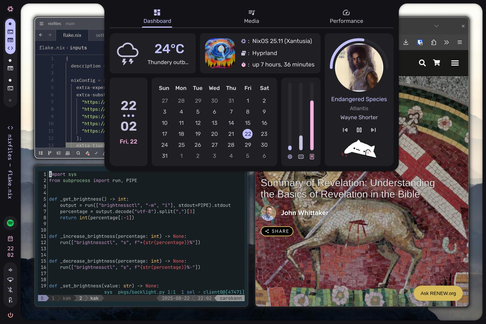

# NixOS config for my personal computer and servers



## Presentation

I have three [NixOS](https://nixos.org) machines:
- _carokann_: personal computer ([Framework](https://frame.work) laptop).
- _najdorf_: server where I deploy my self-hosted apps.
- _grunfeld_: main RaspberryPi that serves as a [snapcast](https://github.com/badaix/snapcast) server and a local backup.

The hosts communicate through [Tailscale](https://tailscale.com).

This repo is structured with the [digga](https://digga.divnix.com) flake library.

### Software I use on my personal computer (carokann)

- Wayland compositor: [hyprland](https://hypr.land)
- Desktop shell: [Caelestia](https://github.com/caelestia-dots/shell)
- Editor: [kakoune](https://github.com/mawww/kakoune)
- Terminal: [wezterm](https://wezterm.org)
- Terminal multiplexer: [tmux](https://github.com/tmux/tmux)
- Shell: [fish](https://fishshell.com)
- Browser: [zen](https://zen-browser.app/)

### Self-hosted apps on my server (najdorf)

I deploy most services as Docker containers through [Arion](https://github.com/hercules-ci/arion)

- [Træfik](https://traefik.io/traefik)
- [Authelia](https://www.authelia.com)
- [LLDAP](https://github.com/lldap/lldap)
- [Nextcloud](https://nextcloud.com)
- [Calibre-web](https://github.com/janeczku/calibre-web)
- [goeland](https://github.com/slurdge/goeland)
- [Immich](https://immich.app)
- [Grist](https://www.getgrist.com/)

Important data is backed up with [Restic](https://restic.net) to a local disk connected to my RaspberryPi.


## Bootstrap
### PC
Create a bootstrap ISO for a personal computer run:
```bash
$ nixos-generate --flake '.#bootstrap' --format iso
```

Then install NixOS:
```bash
$ cd nixfiles
$ sudo disko --mode destroy,format,mount -f '.#carokann'
$ sudo mount /dev/mapper/cryptroot /mnt
$ sudo mkdir /mnt/boot
$ sudo mount /dev/nvme0n1p1 /mnt/boot
$ sudo nixos-install --flake '.#carokann' --root /mnt

# Enroll your fingerprint
$ sudo fprintd-enroll <username>
# Enroll TPM2 for dm-crypt
$ sudo systemd-cryptenroll --tpm2-device=auto /dev/nvme0n1p2
```

After logging in with tailscale and enabling SSH connections (`sudo tailscale set --ssh`), you can backup the important files:
- ~/.ssh
- ~/.local/share/fish/fish_history
- /etc/NetworkManager/system-connections (replace interface names: `sed -i 's/wlp166s0f0/wlp192s0/' *`)
- All documents from ~ that you want to keep

### Raspberry Pi
Create a ready-to-boot SD card for a RaspberryPi, do the following:
```bash
$ nixos-generate --flake '.#grunfeld' --format sd-aarch64 --system aarch64-linux
$ unzstd -d {the output path from the command above} -o nixos-sd-image.img
$ sudo dd if=nixos-sd-image.img of=/dev/sda bs=64K status=progress
```

### Server
Deploy the server config to a new machine:
```bash
# First, comment all services imported in hosts/najdorf/default.nix and uncomment the ts-oneshot-login service line.
# Then run:
$ nixos-anywhere --copy-host-keys --flake '.#najdorf' root@<ip-address>
# Copy the old server's host key
$ scp 'root@najdorf:/etc/ssh/ssh_host_*' root@najdorf-1:/etc/ssh/
# Stop all running services, then:
$ ssh root@najdorf 'ssh-keyscan -H najdorf-1 >> ~/.ssh/known_hosts'
$ ssh -f root@najdorf 'rsync -avz /opt root@najdorf-1:/opt > /home/sweenu/rsync.log 2>&1 &'
# I made all Docker volumes bind mounts in /opt in order for this command to be enough for migrating everything important.
# Uncomment services in hosts/najdorf/default.nix and comment the tailscale-login service line.
# Remove najdorf from tailscale and change the tailscale name from najdorf-1 to najdorf.
# Change DNS records to point to the new server (on Cloudflare, change the IP scope of the API token to the new IP).
# Finally:
$ deploy '.#najdorf'
# All done!
```

## Acknowledgment:
* Thanks to the [digga](https://digga.divnix.com) people for making my life easier when I first started to use NixOS.
* Thanks to [soramanew](https://github.com/soramanew) for the amazing [caelestia shell](https://github.com/caelestia-dots/shell) and for the [hyprland config](https://github.com/caelestia-dots/caelestia/tree/e456e8abb90b94f2e6ae859f6e3b3ef2a5e27099/hypr) from which I took liberally.
